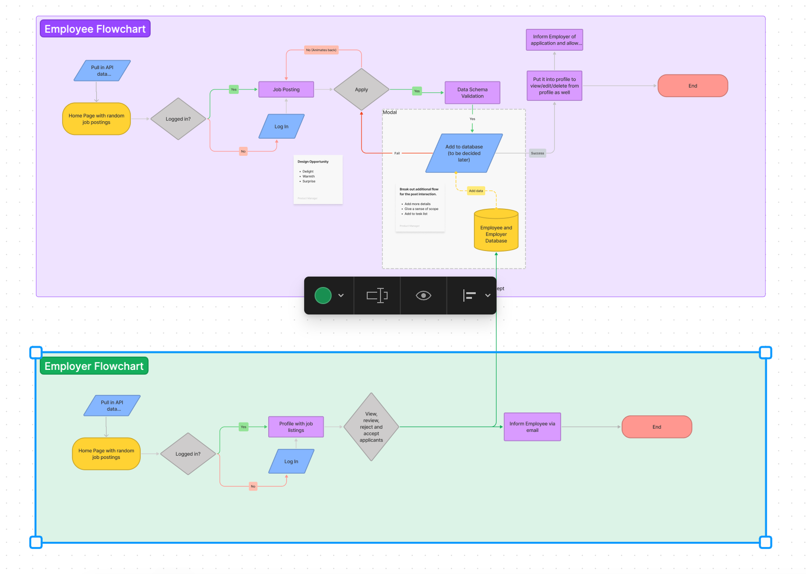

# Software-Engineer-Job-Portal-Frontend

# Summary

Software-Engineered is a job-portal that pulls in various APIs from other job-portals like Nodeflair and other people who create jobs in
the portal to display to potential job seeking software engineers. This job portal has the best of multiple job portals as it aggregates them and takes in other peoples created job to give a plethora of job opportunities for anyone interested in the field of tech. 

# Technologies Used

The backend portion of the Software Engineer Job Portal adheres with the MVC structure, however
our views are on the Front-End side which is built using React. This is a full stack development project which uses the 
ubiquitous and popular MERN (MongoDB, Express JS, React JS, Node JS) stack and has many other libraries and dependencies 
like bcrypt for hasing of passwords or JOI for user validation. For our backend, we use MongoDB as our database with Mongoose as our
object data model and JOI as our validators for our different jobs and users. To store things in the database or perform any other actions, we need to create routes with controllers by using this dependency called routers to separate the user routes and job routes to keep the backend codes easier to read. 

When we are doing login functionality, we need to create a jwt by using the jsonwebtoken library to authorize them to use functions that only logged in individuals can do. With this token, we can decode certain information that is only accessible to them like creating jobs that is uniquely tied to them, view their profile, log them out of their session, etc. Furthermore, we have a middleware to ensure that people do not access certain important routes that only the user can use such as edit of jobs and profile and deleting of jobs and profile. 

# Approach taken

Our backend needed to be setup first and we decided to use MongoDb Atlas as it is a database that can be accessed by people who need to access it. Once we setup our database, we decided to look at different job portals and modelled our schema to resemble theirs as we will be pulling their job data later. Afterwards, we planned and pseudo coded our routes and controllers to get a good grasp of what we needed to do and the potential obstacles that we might face. As we work with the frontend, we slowly develop our routes and controllers in conjunction with our frontend by working on one feature at a time using a feature-based development approach so that we can integrate, troubleshoot and revert if anything were to go terribly wrong. By recursing these steps, we eventually merge the different branches into the development phase before going into the staging phase and finally the production stage once everything is working.

For our frontend, we used a react library called Material UI to do our styling and formatting of our pages. As for our routes, we used 
React Router to do the necessary routing to our various pages via usedNavigate. React router makes it easier for us to declare our routes and to specify where to navigate easily. From there we can also fetch different HTTP request like post or delete by using UseEffect or functions that handle submit buttons to edit different things that we want to edit or delete such as our name, job position, title, etc. 

Managing the frontend and the backend in itself is challenging as there are many permutations and combinations where code conflicts might occur. Hence, we use Trello which is a web-based, Kanban-style, list-making application to keep track of the tasks that we are doing so that we do not encounter issues where we are working on the same thing. The link to our trello workflow and our frontend repo is below.

Link: https://trello.com/b/w74srKq8/sei-project-3

Link to the backend repo: https://github.com/Nihilus888/Software-Engineer-Job-Portal-Backend

# Challenges

To challenge ourselves, we decided to use Material UI to do our UI and React Router to do our routing on the frontend. It was not easy as we
had to read a lot of documentation and watch a lot of tutorials to understand how to use it effectively. Integrating both the frontend and backend repos were pretty hard initially as we needed to understand where we needed to make the API call to the backend to get the necessary info from the Mongo database. 

Learning Json web token and choosing which data to encrypt and sign was something that we need to decide properly as we needed to decode the token later if we need to pull out certain information. Passing the jwt to the frontend, storing it in localstorage and using the information in the localstorage to make the necessary routes or important information that we need to authenticate them. JWT is the backbone of our authorization mechanism and without it, we would have people making invalid requests such as editing or deleting profiles or jobs. 

# Unsolved problems

We did not manage to dynamically render the site header when we log in. We also wanted to call another Job portal API to make merge it
with our current Nodeflaire API search call. However it would be too tedious and time consuming for us to do so as it requires us to create another JOI validator and mongoose data schema to account for that Job portal API and then create one more JOI validator and mongoose data schema for the amalgamation of both common data schema. 

# User Stories

1. As a user, I can register an account with a email and a password with the necessary details to find a job
2. As a user, I can log in into my account and see my profile with the jobs I saved
3. As a user, I can search and save jobs (in a watchlist)
4. As an employer, I can post, edit and delete jobs
5. As a user, I can look at my saved watch list of jobs. Every time I retrieve this list, the job list should be updated with only jobs postings that are still available
6. As a user, I can search for jobs on the search bar and get the job that I searched for from different companies with important details such as title, salary and position. 

# Figma Flowchart

# Project link

https://lunfy.github.io/Software-Engineer-Job-Portal-Frontend/
